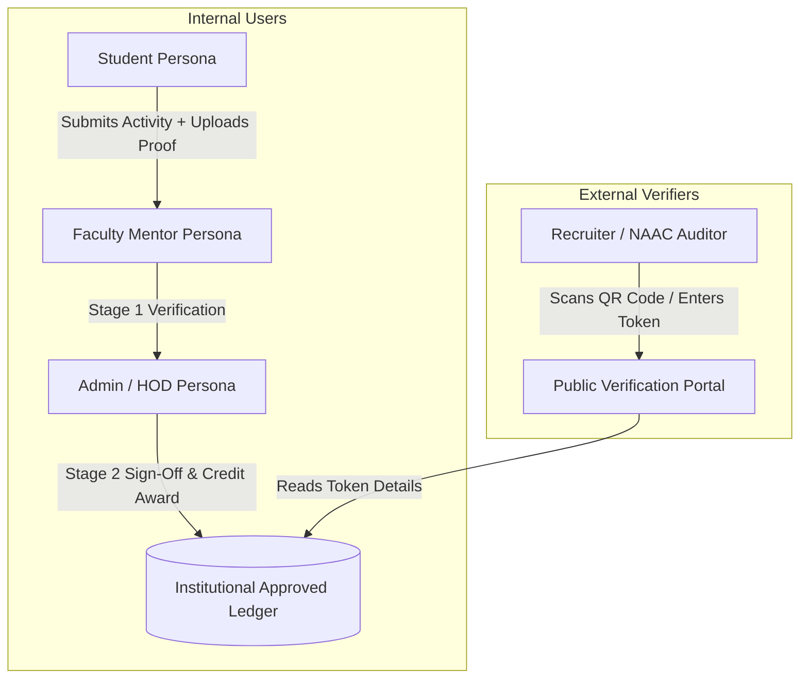

# 01. Project Overview

The **CampusSphere** is an institutional co-curricular activity tracking, credit calculation engine, and verifiable digital credential platform tailored for Indian Higher Education Institutions (HEIs). It aligns student extra-curricular accomplishments directly with national accreditation frameworks, specifically **NAAC (National Assessment and Accreditation Council) Criterion 5** (Student Support and Progression) and **NIRF (National Institutional Ranking Framework)** parameter rankings.

---

## 🎯 The Real-World Problem

In traditional college administrative environments:
1. **Manual & Fraudulent Record Keeping**: Students present paper certificates or self-reported credit values at the end of their degree, making audits labor-intensive and prone to inflation.
2. **Hardcoded/Unstandardized Credit Allocation**: Activity points are often assigned arbitrarily without institutional consistency across different departments or academic years.
3. **Accreditation Submission Overhead**: NAAC accreditation cells spend months manually collecting, verifying, and tallying student achievements across spreadsheets prior to peer-team visits.
4. **Lack of Verifiability for External Stakeholders**: Employers, recruiters, and higher-education institutions cannot independently verify whether a student's co-curricular achievement claims are authentic without contacting college administration.

---

## 💡 The CampusSphere Solution

CampusSphere replaces fragmented paper records with an automated, auditable, and verifiable digital ledger:

```
[Student Submission] ──> [Auto Credit Policy Lookup] ──> [Stage 1: Faculty Mentor Review] ──> [Stage 2: Admin Final Approval] ──> [Cryptographic Verification Token Issued] ──> [Public QR Code Verification]
```

### Key Pillars & Differentiating Features

| Feature Pillar | Description | Accreditation & Administrative Benefit |
| :--- | :--- | :--- |
| **Credit Policy Engine** | Admin-managed matrix mapping activity types (e.g., Hackathons, Certifications, NSS/NCC, Publications) $\times$ achievement levels (State, National, International) to standardized credit point values. | Prevents credit inflation; ensures institution-wide consistency. |
| **Multi-Level Approval Workflow** | Two-stage verification pipeline: `pending_mentor` $\rightarrow$ Stage 1 `mentor_approved` $\rightarrow$ Stage 2 `approved`. | Ensures faculty oversight prior to final institutional credit sign-off. |
| **Verifiable Digital Credentials** | Generates a unique cryptographic token (`vref_...`) on final sign-off with public QR code verification at `/verify/[token]`. | Enables instant third-party validation by recruiters and NAAC auditors without requiring a system login. |
| **NAAC / NIRF Reporting Engine** | Query-driven aggregation layer computing student participation ratios, department breakdowns, and YoY trends. | Filters **strictly on `status = 'approved'`** to guarantee audit-proof accreditation submissions. |
| **Grievance & Appeals Engine** | Formal student resubmission and appeal pipeline for rejected activity entries. | Guarantees transparency and due process for student credit disputes. |

---

## 👥 User Roles & System Personas

The system enforces strict Role-Based Access Control (RBAC) across three primary internal roles and one external observer role:



### 1. Student (`student`)
- **Primary Goal**: Track co-curricular progress toward annual (20.0 credit target) and degree milestone requirements.
- **Key Capabilities**:
  - Submit activity evidence (certificates, links) with automated credit policy preview.
  - Monitor Academic Year (July 1 – June 30) credit progress broken down by NAAC Criterion.
  - Export ATS-compliant digital CV portfolios with embedded verification QR codes.
  - View rejection feedback, resubmit revised evidence, or file formal appeals.

### 2. Faculty Mentor (`faculty`)
- **Primary Goal**: Provide first-line academic oversight for assigned mentee cohorts.
- **Key Capabilities**:
  - Review submitted activity descriptions and certificate document proofs.
  - Approve submissions to Stage 1 (`mentor_approved`) with evaluator remarks.
  - Reject invalid or incomplete submissions with mandatory feedback.
  - Track assigned mentee co-curricular performance statistics.

### 3. Administrator / HOD (`admin`)
- **Primary Goal**: Manage institutional accreditation policies, execute final credit sign-offs, and generate NAAC/NIRF reporting.
- **Key Capabilities**:
  - Manage Credit Policy rules (type, level, credits, NAAC criterion).
  - Execute Stage 2 final approval, granting official credits and issuing cryptographic verification tokens.
  - Revoke invalid credentials with mandatory audit logging and student notifications.
  - Execute bulk CSV student/faculty onboarding with duplicate email detection.
  - Resolve student activity grievances and appeals.
  - Run live, query-driven NAAC Criterion summary and participation ratio reports.

### 4. External Verifier (Unauthenticated Public)
- **Primary Goal**: Validate credential authenticity without logging in.
- **Key Capabilities**:
  - Access `/verify/[verificationId]` to inspect verified student name, activity title, credits awarded, and approval date.
  - View real-time revocation alerts if a credential has been invalidated.
  - Sensitive student data (email, phone, student ID, internal remarks) is strictly redacted.
