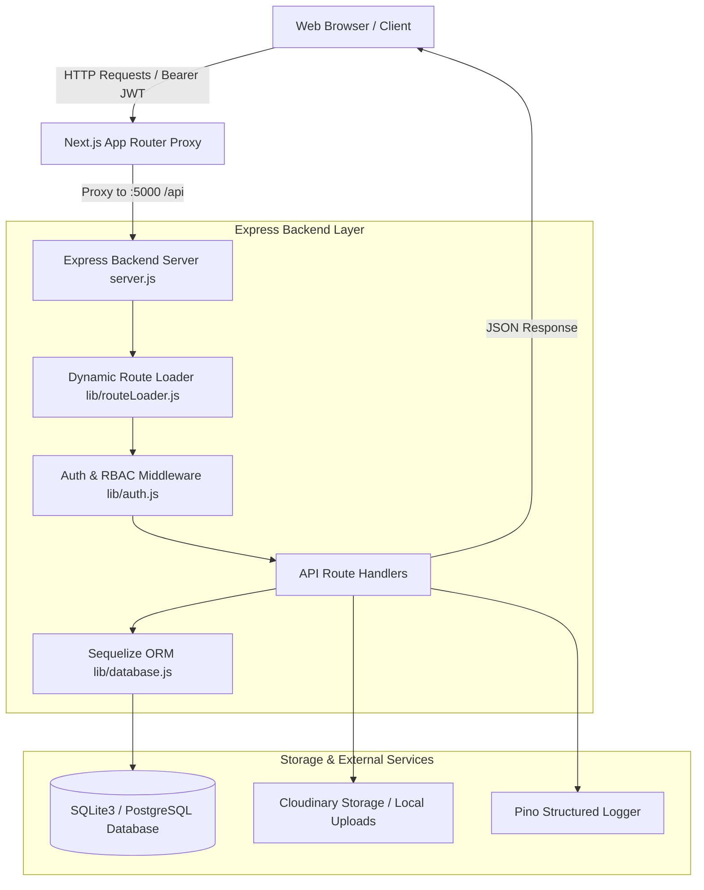

# 03. System Architecture

The **Smart Student Hub** architecture is built around a decoupled client-server pattern: a Next.js 15 frontend consumer communicating via JSON REST APIs with a lightweight Express backend process (`server.js`), backed by Sequelize ORM.

---

## 🏗️ High-Level Request Flow



---

## 🗺️ Role-Based Route Architecture

The frontend maps role-specific feature components into protected route boundaries:

```mermaid
flowchart LR
    subgraph Frontend Application Routes
        Root[/] --> AuthCheck{Authentication State}
        AuthCheck -->|Unauthenticated| Login[/login]
        AuthCheck -->|Role: student| StudentApp[/student/*]
        AuthCheck -->|Role: faculty| FacultyApp[/faculty/*]
        AuthCheck -->|Role: admin| AdminApp[/admin/*]
        
        PublicVerify[/verify/:verificationId] -->|No Auth Required| VerifyPage[Public Verification Page]
    end

    subgraph Student Views
        StudentApp --> S1[Dashboard - AY Credit Progress]
        StudentApp --> S2[Submit Activity - Credit Lookup]
        StudentApp --> S3[Digital Portfolio & QR Export]
        StudentApp --> S4[Activity History & Appeals]
    end

    subgraph Faculty Views
        FacultyApp --> F1[Mentee Roster]
        FacultyApp --> F2[Stage 1 Review Queue]
    end

    subgraph Admin Views
        AdminApp --> A1[Credit Policy Engine]
        AdminApp --> A2[Stage 2 Final Review Queue & Revocation]
        AdminApp --> A3[NAAC / NIRF Reports Engine]
        AdminApp --> A4[User Management & Bulk CSV Onboarding]
        AdminApp --> A5[Grievance Resolution Queue]
    end
```

---

## 🔐 Role-Based Access Control (RBAC) Architecture

Authentication and authorization are strictly enforced at both the HTTP middleware layer and component rendering layer:

### 1. HTTP Middleware Authorization (`backend/lib/auth.js`)
Every protected API route executes `authenticateAndAuthorize(request, allowedRoles)`:
1. Extracts the `Authorization: Bearer <token>` header.
2. Verifies token validity using `jsonwebtoken` and the secret key.
3. Checks user role (`student`, `faculty`, `admin`) against `allowedRoles`.
4. Rejects unauthorized access with `401 Unauthorized` or `403 Forbidden`.

```javascript
// Example API Route Security Check
const auth = await authenticateAndAuthorize(request, ['admin']);
if (auth.error) return NextResponse.json({ error: auth.error }, { status: auth.status });
```

---

## ⚡ Route-Level Code Splitting & Performance Optimization

To guarantee fast initial page loads (`First Load JS` ~108 kB – 122 kB across all 20 routes), heavy client-side libraries are loaded lazily via **Dynamic Imports**:

### 1. PDF Portfolio Generation (`jspdf`)
Instead of bundling the `jsPDF` engine into the global client bundle, it is imported dynamically only when a student clicks **[Download CV (PDF)]**:
```javascript
const { default: jsPDF } = await import('jspdf');
```

### 2. QR Code Rendering (`qrcode`)
Similarly, the QR matrix generator is dynamically loaded only during PDF generation or when the user opens the QR Code modal:
```javascript
const QRCode = await import('qrcode');
```

### Bundle Size Verification Breakdown

| Route | Route Type | First Load JS | Optimization Notes |
| :--- | :--- | :--- | :--- |
| `/` | Static | `105 kB` | Minimal landing shell |
| `/login` | Static | `112 kB` | Auth form component |
| `/student/dashboard` | Static | `122 kB` | Student stats & progress bar |
| `/student/portfolio` | Static | `119 kB` | Dynamic `jspdf` & `qrcode` imports |
| `/faculty/review` | Static | `112 kB` | Mentor review card queue |
| `/admin/reports` | Static | `112 kB` | Aggregate NAAC reporting tables |
| `/admin/users` | Static | `119 kB` | User directory & Bulk CSV modal |
| `/verify/[verificationId]` | Dynamic | `108 kB` | Light public verification page |
