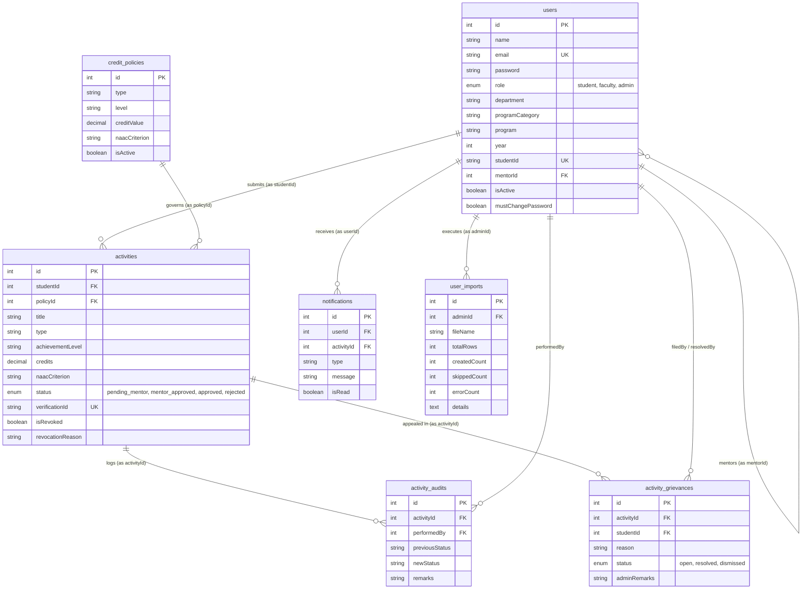

# 04. Database Schema & Data Models

The **Smart Student Hub** database is managed using **Sequelize ORM** with migration audit history (`backend/migrations/`). It supports both SQLite3 for development and PostgreSQL for production.

---

## 📊 Entity Relationship Diagram (ERD)

---

## 📋 Data Model Specifications

### 1. `users` Table (`User.js`)
Stores account profiles across all system roles.

| Column Name | Data Type | Constraints | Description |
| :--- | :--- | :--- | :--- |
| `id` | INTEGER | PK, Auto Increment | Primary key |
| `name` | STRING | NOT NULL | User full name |
| `email` | STRING | NOT NULL, UNIQUE | User email address |
| `password` | STRING | NOT NULL | Hashed password (bcrypt) |
| `role` | ENUM | 'student', 'faculty', 'admin' | System access role |
| `department` | STRING | NULL | Academic department (e.g. CSE) |
| `programCategory` | STRING | NULL | Category (e.g. Engineering) |
| `program` | STRING | NULL | Degree program (e.g. B.Tech) |
| `year` | INTEGER | NULL | Current academic year (1-5) |
| `studentId` | STRING | NULL, UNIQUE | Institutional Roll / ID number |
| `mentorId` | INTEGER | FK -> `users.id` | Assigned faculty mentor ID |
| `isActive` | BOOLEAN | DEFAULT true | Account active flag |
| `mustChangePassword` | BOOLEAN | DEFAULT false | Forced password reset flag on 1st login |

---

### 2. `credit_policies` Table (`CreditPolicy.js`)
Admin-configured rules mapping activity parameters to awarded credits.

| Column Name | Data Type | Constraints | Description |
| :--- | :--- | :--- | :--- |
| `id` | INTEGER | PK, Auto Increment | Primary key |
| `type` | STRING | NOT NULL | Activity type (e.g. `hackathon`, `workshop`) |
| `level` | STRING | NOT NULL | Achievement level (e.g. `national`, `state`) |
| `creditValue` | DECIMAL(4,1) | NOT NULL | Default credit points awarded |
| `naacCriterion` | STRING | NOT NULL | Mapped NAAC Criterion (e.g. `Criterion 5`) |
| `isActive` | BOOLEAN | DEFAULT true | Policy active status |

---

### 3. `activities` Table (`Activity.js`)
Co-curricular activity submissions and accreditation records.

| Column Name | Data Type | Constraints | Description |
| :--- | :--- | :--- | :--- |
| `id` | INTEGER | PK, Auto Increment | Primary key |
| `studentId` | INTEGER | FK -> `users.id` | Submitting student ID |
| `policyId` | INTEGER | FK -> `credit_policies.id` | Mapped credit policy ID |
| `title` | STRING | NOT NULL | Activity event title |
| `type` | STRING | NOT NULL | Category classification |
| `achievementLevel` | STRING | NOT NULL | Level achieved |
| `credits` | DECIMAL(4,1) | NOT NULL | Credit points awarded |
| `naacCriterion` | STRING | NOT NULL | NAAC Criterion category |
| `status` | ENUM | 'pending_mentor', 'mentor_approved', 'approved', 'rejected' | Two-stage approval state |
| `verificationId` | STRING | NULL, UNIQUE | Cryptographic token (`vref_...`) |
| `isRevoked` | BOOLEAN | DEFAULT false | Revocation audit flag |
| `revokedAt` | DATE | NULL | Timestamp of revocation |
| `revocationReason` | TEXT | NULL | Mandatory admin revocation reason |

---

### 4. `notifications` Table (`Notification.js`)
In-app alert notifications for submission events and review results.

| Column Name | Data Type | Constraints | Description |
| :--- | :--- | :--- | :--- |
| `id` | INTEGER | PK, Auto Increment | Primary key |
| `userId` | INTEGER | FK -> `users.id` | Recipient user ID |
| `activityId` | INTEGER | FK -> `activities.id` | Related activity submission ID |
| `type` | STRING | NOT NULL | Alert category (`activity_approved`, `activity_rejected`, `activity_revoked`) |
| `message` | TEXT | NOT NULL | Human-readable notification body |
| `isRead` | BOOLEAN | DEFAULT false | Read status flag |

---

### 5. `user_imports` Table (`UserImport.js`)
Audit trail logs for administrative bulk CSV user onboarding executions.

| Column Name | Data Type | Constraints | Description |
| :--- | :--- | :--- | :--- |
| `id` | INTEGER | PK, Auto Increment | Primary key |
| `adminId` | INTEGER | FK -> `users.id` | Admin who executed import |
| `fileName` | STRING | NOT NULL | Uploaded CSV filename |
| `totalRows` | INTEGER | DEFAULT 0 | Total rows parsed |
| `createdCount` | INTEGER | DEFAULT 0 | Successfully created users |
| `skippedCount` | INTEGER | DEFAULT 0 | Skipped duplicate emails |
| `errorCount` | INTEGER | DEFAULT 0 | Row validation failures |
| `details` | TEXT | NULL | JSON string of row-by-row audit log |

---

## 📜 Migration Audit History

Database schema updates are applied incrementally via `backend/scripts/migrate.js`:

1. `20260812_000001_initial_schema.js` — Core users and initial activities tables.
2. `20260812_000002_credit_policies_and_two_stage_reviews.js` — Credit policy engine rules and two-stage review columns (`mentorReviewedBy`, `finalApprovedBy`).
3. `20260812_000003_notifications_grievances_audits.js` — Notifications table, activity audits table, and activity grievances table.
4. `20260812_000004_verifiable_records_revocation.js` — Cryptographic `verificationId` tokens and credential revocation columns.
5. `20260812_000005_phase5_engagement_and_bulk_onboarding.js` — `mustChangePassword` user column and `user_imports` audit table.
