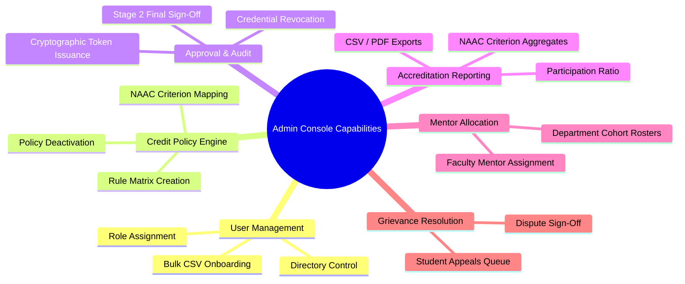

# Admin 01. Functionality Overview

The **Admin Console** is the administrative command center for the CampusSphere. It equips institutional administrators, HODs, and NAAC Accreditation Officers with centralized control over credit rules, user directories, multi-level activity sign-offs, and reporting metrics.

---

## 🛠️ Summary of Administrative Capabilities

---

## 📋 Comprehensive Feature Breakdown

### 1. User Directory & Access Management
- **Directory Operations**: View, filter, and manage all registered student, faculty, and administrator accounts across departments.
- **Role Assignment**: Assign or update academic roles (`student`, `faculty`, `admin`).
- **Account Status Toggles**: Activate or deactivate user access instantaneously.
- **Bulk CSV Onboarding**: Upload CSV files containing hundreds of student/faculty records with row-level validation and duplicate email detection.

### 2. Credit Policy Engine Management
- **Policy Rule Matrix**: Configure standardized rules mapping **Activity Type** (Hackathon, Certification, Sports, NSS/NCC, Workshop, Publication, Internship) $\times$ **Achievement Level** (College, State, National, International) to default credit values.
- **NAAC Criterion Mapping**: Map activity policies directly to NAAC criteria (e.g. Criterion 5: Student Support and Progression).
- **Rule Lifecycle**: Enable, edit, or deactivate policy rules dynamically without code modifications.

### 3. Stage 2 Final Approval Authority & Revocation
- **Stage 2 Sign-Off Queue**: Review mentor-verified submissions (`mentor_approved`) and execute final institutional sign-off (`approved`).
- **Token Generation**: Automatically issue cryptographic verification tokens (`vref_...`) on final sign-off.
- **Revocation Audit Engine**: Revoke previously approved credentials if evidence is found invalid, capturing mandatory revocation reasons and notifying the student.

### 4. NAAC / NIRF Institutional Reporting Engine
- **Calculative Aggregations**: Generate live, query-driven accreditation statistics filtered **strictly on `status = 'approved'`**.
- **Participation Ratio**: Compute the institutional participation ratio percentage ($\frac{\text{Distinct Active Students with }\ge 1\text{ Approved Activity}}{\text{Total Active Enrolled Students}} \times 100$).
- **Multi-Filter Analysis**: Filter reporting metrics by Academic Year, Department, and NAAC Criterion.
- **Export Engine**: Export accreditation datasets to structured CSV files or printable PDF reports.

### 5. Mentor-Mentee Roster Allocation
- **Mentor Assignment**: Assign faculty mentors to student cohorts individually or in bulk by department/program/year.
- **Review Queue Routing**: Direct student activity submissions to their designated faculty mentor's Stage 1 evaluation queue.

### 6. Student Grievance & Appeal Resolution
- **Grievance Queue**: Review student appeals filed against rejected activity submissions.
- **Dispute Resolution**: Re-evaluate evidence, issue admin resolution remarks, and update activity status (`approved` or `dismissed`).
