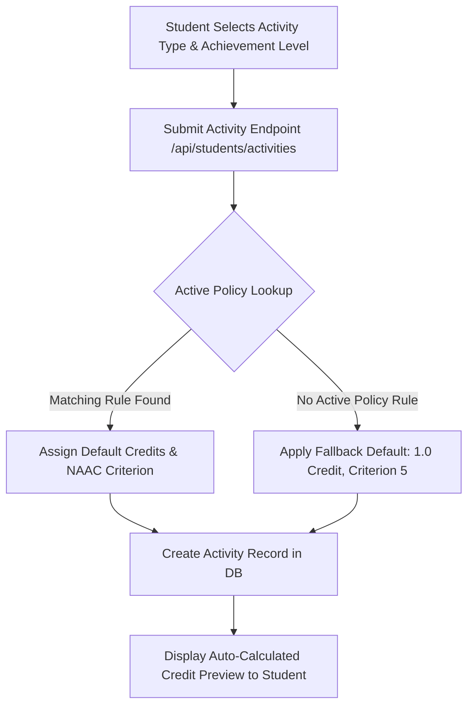

# Admin 02. Credit Policy Engine

The **Credit Policy Engine** eliminates manual, arbitrary credit assignment by establishing an institution-wide, admin-managed matrix:

$$\text{Activity Type} \times \text{Achievement Level} \longrightarrow \text{Credit Weight} + \text{NAAC Criterion Category}$$

When a student submits an activity, the system looks up the active policy rule matching their selected category and level, automatically setting the credit value and NAAC criterion.

---

## 🔄 Automated Credit Policy Lookup Flow

---

## 📊 Representative Credit Policy Rules

Below is a representative sample of active credit policy rules seeded in the database (Migration `20260812_000002_credit_policies_and_two_stage_reviews.js` defines 36 policy combinations across 7 activity categories):

| Category Type | Achievement Level | Credit Weight | NAAC Criterion | Administrative Context |
| :--- | :--- | :--- | :--- | :--- |
| `hackathon` | `college` | **2.0** | `Criterion 5` | Intra-college coding competitions |
| `hackathon` | `state` | **4.0** | `Criterion 5` | State-level hackathon participation/win |
| `hackathon` | `national` | **6.0** | `Criterion 5` | SIH / National hackathon awards |
| `hackathon` | `international` | **8.0** | `Criterion 5` | Global competitive tech events |
| `certification` | `college` | **1.0** | `Criterion 1` | Departmental skill workshops |
| `certification` | `national` | **3.0** | `Criterion 1` | NPTEL / SWAYAM / Coursera certificate |
| `sports` | `state` | **3.0** | `Criterion 5` | Inter-university / State sports meet |
| `sports` | `national` | **5.0** | `Criterion 5` | National games / Khelo India participation |
| `nss_ncc` | `college` | **2.0** | `Criterion 3` | Campus extension activities |
| `nss_ncc` | `national` | **5.0** | `Criterion 3` | Republic Day Parade / National Camps |
| `publication` | `national` | **4.0** | `Criterion 3` | UGC Care list journal publication |
| `publication` | `international` | **8.0** | `Criterion 3` | Scopus / IEEE conference paper |

---

## 💡 Practical Scenario Example

### Scenario: National Hackathon Winner
1. **Student Action**: A student submits an entry titled *"Smart India Hackathon 2026 Winner"*, selecting Type = `hackathon` and Level = `national`.
2. **Engine Processing**: The backend queries `credit_policies` for `type = 'hackathon'` AND `level = 'national'` AND `isActive = true`.
3. **Automated Result**: The record is instantly populated with `credits = 6.0` and `naacCriterion = 'Criterion 5'`. The student cannot manually override or inflate this value.
4. **Admin Customization**: An Admin can edit the rule in the Admin Console (e.g. updating `national` hackathons from 6.0 to 7.0 credits); all subsequent student submissions automatically receive the updated 7.0 credit value.
