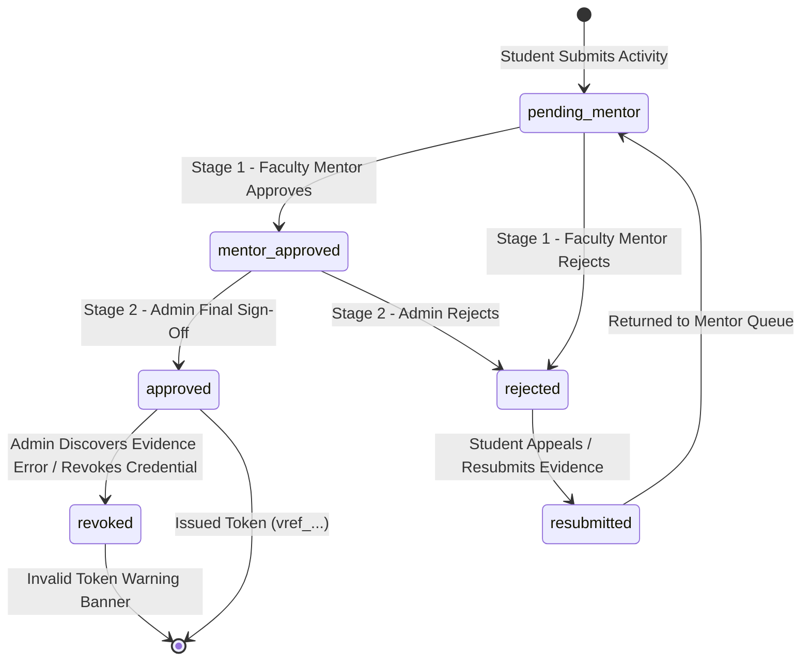

# Admin 03. Multi-Level Approval & Revocation Workflow

The **Multi-Level Approval Workflow** guarantees academic oversight and administrative compliance. Activity submissions pass through a two-stage verification pipeline before credits are officially awarded and cryptographic verification tokens are issued.

---

## 🔄 State Diagram: Multi-Level Review & Revocation Lifecycle

---

## 📋 Detailed Stage Breakdown

| Status Stage | Responsible Persona | Administrative Actions & System Behavior |
| :--- | :--- | :--- |
| `pending_mentor` | **Faculty Mentor** | Initial submission. Appears in assigned mentor's Stage 1 evaluation queue. Credits are **unearned**. |
| `mentor_approved` | **Faculty Mentor** | Stage 1 passed. Faculty confirms certificate proof is authentic. Submission advances to Admin Stage 2 queue. Credits remain **unearned**. |
| `rejected` | **Mentor or Admin** | Evaluator rejects submission with mandatory remarks. Student receives an in-app notification and email alert. |
| `resubmitted` | **Student** | Student responds to rejection feedback, updates document proof/description, and resubmits for re-evaluation. |
| `approved` | **Admin / HOD** | **Stage 2 Final Sign-Off**. Official institutional credits are granted. Cryptographic `verificationId` (`vref_...`) is generated. Activity counts toward NAAC reports. |
| `revoked` | **Admin / HOD** | Admin revokes a previously approved credential. `isRevoked = true`, revocation reason logged, student notified, public token URL displays red revocation alert. |

---

## 💡 Practical Scenario Example

### Scenario: Certificate Fraud Audit & Credential Revocation
1. **Initial Approval**: A student submits a *"National Cyber Security Workshop"* certificate. The Faculty Mentor approves Stage 1 (`mentor_approved`), and the HOD executes Stage 2 final sign-off (`approved`). The system generates verification token `vref_9a8b7c6d5e4f3a2b`.
2. **Audit Discovery**: Two months later, an accreditation audit reveals the certificate image was tampered with.
3. **Admin Revocation Action**: An Admin opens [FinalReviewQueue.jsx](file:///d:/Edutation(P)/SIH/smart-student-hub/frontend/components/admin/FinalReviewQueue.jsx), navigates to **Approved Ledger**, inputs mandatory remarks (*"Credential revoked due to tampered certificate evidence during audit"*), and clicks **[⚠️ Revoke Approval]**.
4. **System Response**:
   - Updates record to `isRevoked = true`, `revokedAt = NOW()`, `status = 'rejected'`.
   - Logs audit trail entry in `activity_audits`.
   - Triggers student notification: *"Your credential for National Cyber Security Workshop has been revoked by Admin."*
   - Public verification link `/verify/vref_9a8b7c6d5e4f3a2b` instantly displays a red warning: **"CREDENTIAL OFFICIALLY REVOKED"**.
