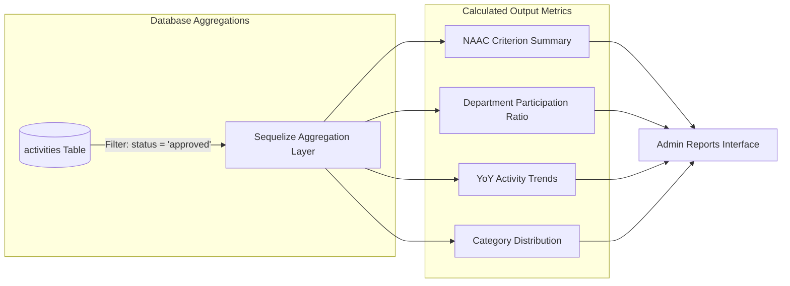

# Admin 04. NAAC / NIRF Reporting & Analytics

The **NAAC / NIRF Institutional Reporting Engine** ([`frontend/components/admin/Reports.jsx`](file:///d:/Edutation(P)/SIH/smart-student-hub/frontend/components/admin/Reports.jsx)) delivers calculative, query-driven accreditation statistics derived directly from live database aggregations.

> ⚠️ **Critical Data Integrity Guarantee**: Every report and metric filters **strictly on `status = 'approved'`**. Activities in `pending_mentor`, `mentor_approved`, or `rejected` states are strictly excluded to ensure accreditation submissions are 100% audit-proof.

---

## 📐 Core Aggregation Metrics & Formulas

### 1. Student Participation Ratio Formula

$$\text{Participation Ratio (\%)} = \left( \frac{\text{Distinct Enrolled Active Students with } \ge 1 \text{ Approved Activity}}{\text{Total Active Enrolled Students in Scope}} \right) \times 100$$

- **Numerator**: SQL `COUNT(DISTINCT studentId)` from `activities` where `status = 'approved'`.
- **Denominator**: SQL `COUNT(id)` from `users` where `role = 'student'` AND `isActive = true`.

---

## 📊 Summary of Accreditation Reports

| Report View | Aggregation Logic | NAAC / NIRF Utility |
| :--- | :--- | :--- |
| **Criterion Summary Table** | Groups approved activities by `naacCriterion` (Criterion 1 to 7), summing `COUNT(id)` and `SUM(credits)`. | Directly populates NAAC Self-Study Report (SSR) Criterion 5.3 tables. |
| **Department Breakdown Table** | Groups approved activities by student `department`, computing total approved activities, earned credits, and participation ratio %. | Measures inter-departmental co-curricular performance for NIRF Parameter 3 (Outreach and Inclusivity). |
| **Year-over-Year (YoY) Trends** | Groups approved activities by completion year (`date`), comparing historical activity volume growth. | Demonstrates institutional growth metrics during NAAC peer-team visits. |
| **Category Distribution** | Groups approved activities by activity type (Hackathons, Certifications, Sports, NSS/NCC, Publications). | Assesses diversity of co-curricular engagement across technical and societal domains. |

---

## 📥 Export Capabilities

Administrators can export verified accreditation metrics into two standard formats:

1. **Structured CSV Export**: Exports tabular data rows (Criterion, Department, Student Count, Total Credits, Participation Ratio %) ready for MS Excel / SSR upload.
2. **Printable PDF Accreditation Report**: Formats report cards, data integrity timestamps, and criterion tables into a clean document layout suitable for printing or archiving.
