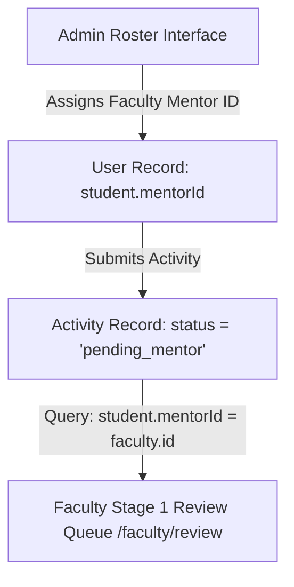

# Admin 05. Mentor Allocation & Roster Management

The **Mentor Allocation System** ([`frontend/components/admin/MentorManagement.jsx`](file:///d:/Edutation(P)/SIH/smart-student-hub/frontend/components/admin/MentorManagement.jsx)) connects faculty evaluators to student cohorts, ensuring every student has a designated mentor for Stage 1 activity reviews.

---

## 🔗 Mentor Routing Architecture

---

## 📋 Allocation Features

### 1. Individual & Cohort Mentor Assignment
- **Individual Assignment**: Admins can assign or change an individual student's designated faculty mentor from the user directory.
- **Bulk Cohort Assignment**: Select multiple students filtered by **Department** (e.g. Computer Science), **Degree Program** (e.g. B.Tech), and **Academic Year** (e.g. Year 3), assigning the entire cohort to a faculty mentor in one operation.

### 2. Departmental Roster Tracking
- View mentor workload metrics: number of assigned mentees per faculty member, total pending Stage 1 submissions awaiting mentor review, and average review response times.
- Reassign mentees seamlessly when faculty members take leave or shift departments.

---

## 💡 Practical Scenario Example

### Scenario: Batch Mentor Allocation at Term Start
1. **Context**: At the beginning of the academic year, 60 newly enrolled Year 3 B.Tech Computer Science students need mentor assignment.
2. **Admin Action**:
   - Admin opens the **Mentor Allocation** panel.
   - Sets filters: Department = `Computer Science & Engineering`, Program = `B.Tech`, Year = `3`.
   - Selects **Dr. Sarah Jenkins** from the faculty dropdown.
   - Clicks **[Assign Selected Cohort (60 Students)]**.
3. **System Behavior**:
   - Executes `PUT /api/admin/mentors` updating `mentorId = SarahJenkins.id` for all 60 student records.
   - Future activity submissions by these 60 students automatically populate in Dr. Sarah Jenkins's Stage 1 review queue (`/faculty/review`).
