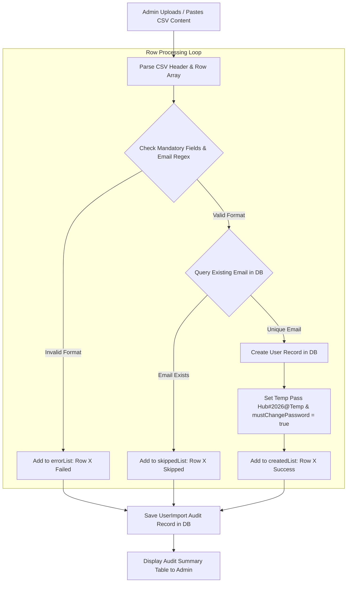

# Admin 06. Bulk User Onboarding via CSV

The **Bulk User Onboarding Engine** ([`frontend/components/admin/UserManagement.jsx`](file:///d:/Edutation(P)/SIH/smart-student-hub/frontend/components/admin/UserManagement.jsx) & [`backend/routes/admin/users/bulk-import/route.js`](file:///d:/Edutation(P)/SIH/smart-student-hub/backend/routes/admin/users/bulk-import/route.js)) enables rapid onboarding of student and faculty cohorts at the start of an academic year.

---

## 📥 CSV File Schema & Headers

The uploaded CSV file must contain a header row matching the following column names:

```csv
name,email,role,department,program,year,studentId
John Doe,john.doe@university.edu,student,Computer Science & Engineering,Bachelor of Technology,3,STU-2026-001
Jane Smith,jane.smith@university.edu,faculty,Computer Science & Engineering,,,
```

### Required Header Descriptions

| Header Name | Required? | Valid Values / Constraints | Example Value |
| :--- | :--- | :--- | :--- |
| `name` | **Yes** | Non-empty string | `Arpan Pramanik` |
| `email` | **Yes** | Valid RFC-822 email format | `arpan@university.edu` |
| `role` | **Yes** | `student`, `faculty`, or `admin` (Default: `student`) | `student` |
| `department` | Recommended | Academic department string | `Computer Science & Engineering` |
| `program` | Student | Degree program | `Bachelor of Technology` |
| `year` | Student | Integer `1` through `5` | `3` |
| `studentId` | Student | Unique institutional Roll / ID number | `STU-2026-042` |

---

## ⚙️ Processing & Validation Workflow



---

## 🔐 Credentials & Password Policy

For security compliance during bulk account creation:
1. **Initial Temporary Credential**: Every bulk-created account is assigned an initial temporary password: `Hub#2026@Temp`.
2. **Forced First-Login Reset**: The database record sets `mustChangePassword = true`.
3. **Login Redirection**: Upon the user's first login with the temporary credential, the frontend automatically prompts them to set a private password before granting access to dashboard features.

---

## 📊 Import Audit Trail & Log Output

After execution, the system saves an audit log entry in the `user_imports` table (`adminId`, `fileName`, `totalRows`, `createdCount`, `skippedCount`, `errorCount`, `details`) and renders an interactive summary report for the Admin:

```
✓ Import Executed Successfully: 42 Created | 5 Skipped (Duplicates) | 2 Validation Errors
• Row 14: john.doe@university.edu — Account with this email already exists (Skipped)
• Row 23: invalid.email.com — Invalid or missing email format (Failed)
```
