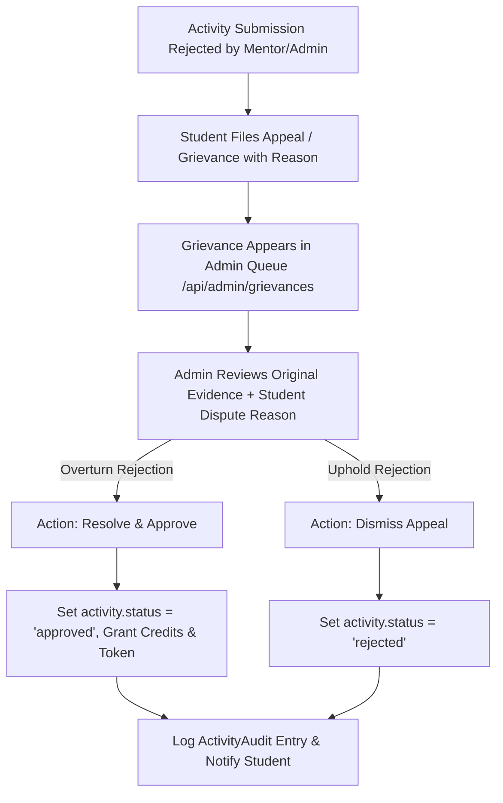

# Admin 07. Grievance & Appeal Resolution Queue

The **Grievance Resolution System** ([`frontend/components/admin/GrievanceQueue.jsx`](file:///d:/Edutation(P)/SIH/smart-student-hub/frontend/components/admin/GrievanceQueue.jsx)) provides a formal administrative appeal mechanism for students who dispute a rejected activity submission.

---

## ⚖️ Grievance Resolution Workflow

---

## 📋 Grievance Management Features

### 1. Centralized Appeals Queue
- **Appeals Dashboard**: Displays all open student grievances with submission details, rejection reasons, student dispute statements, and original certificate evidence files.
- **Filter Controls**: Filter grievances by status (`open`, `resolved`, `dismissed`) or academic department.

### 2. Resolution Actions
- **Resolve & Approve**: Overturn a previous rejection if the student provides valid clarification or additional evidence. Updates activity status to `approved`, awards credit points, and issues a cryptographic verification token.
- **Dismiss Appeal**: Uphold the original rejection if the evidence remains insufficient. Retains `rejected` status with formal admin resolution remarks.

---

## 💡 Practical Scenario Example

### Scenario: Overturning a Mentor Rejection
1. **Initial Dispute**: A student's *State Level Table Tennis Championship* submission was rejected by their mentor due to an unreadable certificate scan.
2. **Student Appeal**: The student uploads a high-resolution PDF certificate and files an appeal: *"Uploaded high-resolution PDF proof directly issued by the State Sports Authority."*
3. **Admin Resolution**:
   - Admin inspects the new PDF certificate in the Grievance Queue.
   - Selects **Resolve & Approve**, adding remarks: *"Clear certificate evidence verified. Overturning mentor rejection and awarding 3.0 credits."*
4. **System Response**:
   - Updates `activity.status = 'approved'`, awards `3.0` credits under `Criterion 5`.
   - Generates cryptographic token `vref_...`.
   - Sends in-app notification & email alert to the student: *"Your grievance for State Level Table Tennis Championship has been resolved & approved."*
