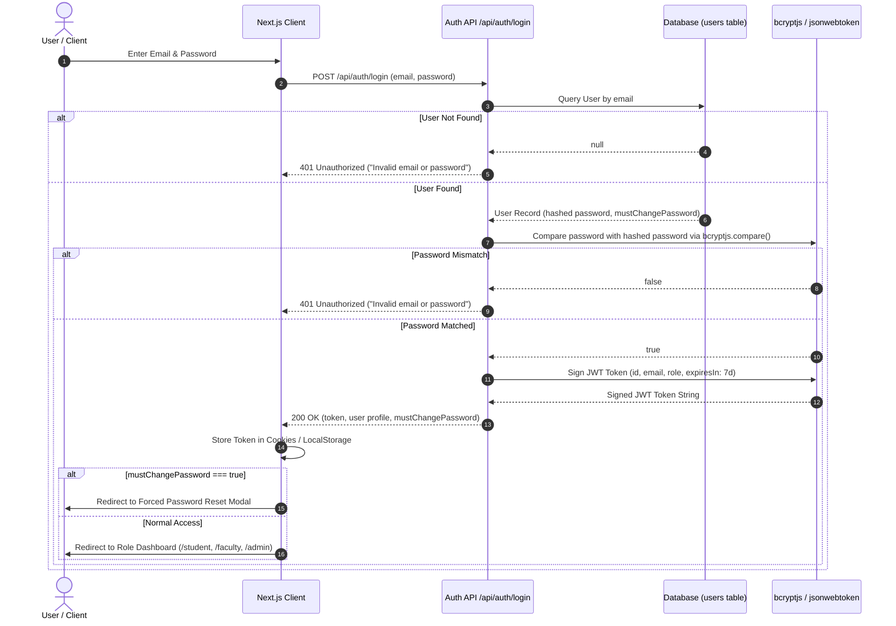

# Auth 01. Authentication Flow & Security Architecture

The **CampusSphere Authentication Architecture** manages identity verification, JWT token issuance, session maintenance, and account credential security across all system roles.

---

## 🔄 Sequence Diagram: Login & Token Generation Sequence

---

## 🔒 Security Safeguards & Credential Management

### 1. JWT Token Specification & Secret Handling
- **Algorithm**: HMAC SHA-256 token signatures generated via `jsonwebtoken`.
- **Payload Claims**: Contains user primary key (`id`), lowercase `email`, system `role`, and token expiration (`exp`).
- **Secret Isolation**: Signed using `JWT_SECRET` stored in environment variables (`.env.local`). Fallback defaults are strictly restricted in production environments.
- **Request Authorization**: Protected endpoints require the header `Authorization: Bearer <token>`.

### 2. Password Encryption Standard
- User passwords are encrypted using `bcryptjs` with **10 salt rounds** before insertion into the `users` table.
- Plaintext passwords are never logged, cached, or returned in API responses.

### 3. Forced First-Login Password Change (`mustChangePassword`)
- Bulk-imported or admin-created accounts receive a temporary password (`Hub#2026@Temp`) and `mustChangePassword = true`.
- Upon successful login, the frontend intercepts the session and prompts the user to submit a private password via `POST /api/auth/change-password`, which sets `mustChangePassword = false`.

### 4. Auth Route Rate Limiting & Admin Protections
- **Rate Limiting**: Authentication endpoints (`/api/auth/login`, `/api/auth/register`) enforce IP-based rate limiting to mitigate brute-force password guessing attacks.
- **Admin Credential Protections**: Admins cannot delete their own active account or modify critical system roles without secondary confirmation.
