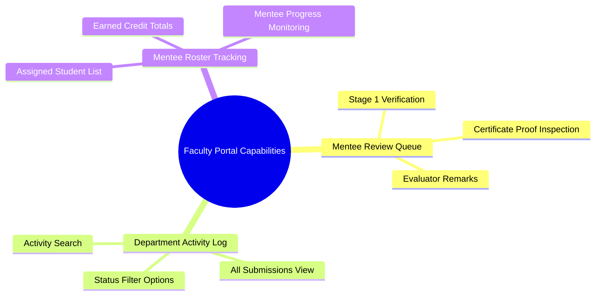

# Faculty 01. Functionality Overview

The **Faculty Mentor Portal** is designed for academic evaluators responsible for reviewing, verifying, and guiding assigned student mentee cohorts through their co-curricular credit progression.

---

## 🛠️ Summary of Faculty Capabilities

---

## 📋 Comprehensive Feature Breakdown

### 1. Stage 1 Mentee Review Queue ([`FacultyReview.jsx`](file:///d:/Edutation(P)/SIH/smart-student-hub/frontend/components/faculty/FacultyReview.jsx))
- **Assigned Submissions Queue**: Displays activity submissions from students assigned to the logged-in faculty member as mentees (`status = 'pending_mentor'`).
- **Evidence Document Inspection**: Direct link to open and inspect uploaded certificate image/PDF evidence.
- **Stage 1 Verification**: Advance verified submissions to Stage 1 `mentor_approved` status with optional evaluator comments.
- **Submission Rejection**: Reject invalid, incomplete, or unverified submissions with mandatory evaluator feedback.

### 2. Department & Institutional Activity Log ([`AllActivities.jsx`](file:///d:/Edutation(P)/SIH/smart-student-hub/frontend/components/faculty/AllActivities.jsx))
- **Broad Oversight**: Browse all student activity submissions across the department.
- **Multi-Filter Capabilities**: Filter submissions by status (`pending_mentor`, `mentor_approved`, `approved`, `rejected`), activity category (Hackathon, Sports, NSS, etc.), or search by student name/ID.
- **Audit Details**: View complete review audit history (Stage 1 mentor approval date, mentor remarks, Stage 2 admin sign-off date).

### 3. Student Roster & Mentee Cohort Tracking ([`FacultyStudents.jsx`](file:///d:/Edutation(P)/SIH/smart-student-hub/frontend/components/faculty/FacultyStudents.jsx))
- **Mentee Roster**: View assigned student mentees with program, specialization, and year details.
- **Credit Summary**: Track total approved credits earned by each mentee to identify students needing guidance or additional co-curricular participation.
- **Direct Engagement**: Access student contact profiles to offer academic mentoring.
