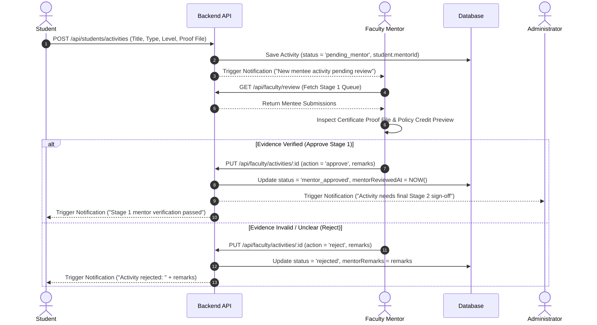

# Faculty 02. Mentee Review Workflow

The **Stage 1 Mentee Review Workflow** is the initial academic verification checkpoint. Faculty mentors review activity evidence uploaded by assigned mentees to ensure authenticity before advancing the record to Stage 2 Admin final sign-off.

---

## 🔄 Sequence Diagram: Mentee Activity Evaluation Sequence

---

## 📋 Evaluation Rules & Mentoring Guidelines

| Review Action | Status Result | Mandatory Input | Next System State |
| :--- | :--- | :--- | :--- |
| **Stage 1 Approve** | `mentor_approved` | Optional Remarks | Record moves to Admin Stage 2 Review Queue. Credits remain **unearned**. |
| **Reject** | `rejected` | Mandatory Rejection Reason | Record status becomes `rejected`. Notification sent to student with remarks. |

---

## 💡 Practical Scenario Examples

### Scenario A: Reviewing a Resubmitted Activity
1. **Context**: A student's *State Level Quiz Competition* submission was previously rejected due to a blurry certificate photo.
2. **Student Action**: The student uploads a clear PDF document and resubmits the entry (status becomes `pending_mentor`).
3. **Faculty Review**:
   - Mentor opens the Stage 1 queue and clicks **[📄 View Verification Certificate Evidence]**.
   - Confirms the PDF is crisp, legible, and issued by the State Quiz Federation.
   - Enters remarks: *"High-resolution PDF evidence verified."*
   - Clicks **[Approve Stage 1]**.
4. **System Response**: Status updates to `mentor_approved`; notification sent to Admin Stage 2 Queue.

### Scenario B: Handling Broken or Suspicious Links
1. **Context**: A student submits a *Web Development Workshop* entry with a broken Google Drive certificate link.
2. **Faculty Action**: Mentor clicks the link, receives a 404 error, and inputs rejection remarks: *"Evidence link is broken/inaccessible. Please re-upload a direct PDF or valid image proof."*
3. **Faculty Click**: Clicks **[Reject Activity]**.
4. **System Response**: Status becomes `rejected`; student receives immediate notification with the mentor's instructions to fix the evidence.
