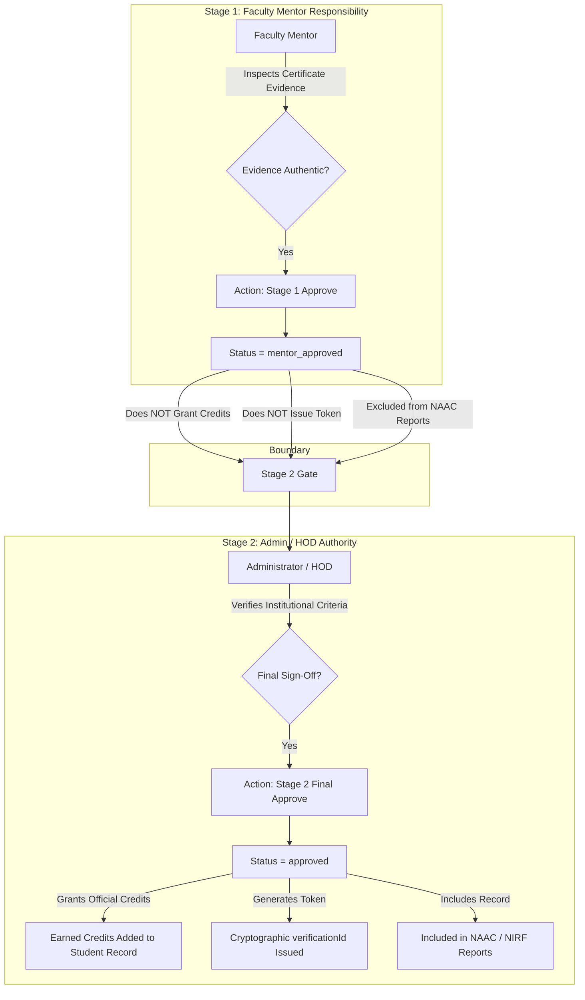

# Faculty 03. Distinction Between Stage 1 Mentor Approval & Stage 2 Admin Approval

To maintain academic integrity and prevent credit inflation, the CampusSphere strictly separates **Stage 1 Faculty Mentor Verification** from **Stage 2 Administrator Final Approval**.

---

## ⚖️ Division of Authority Matrix

---

## 📋 Comprehensive Authority Comparison Table

| Capability / Attribute | Stage 1: Faculty Mentor Approval | Stage 2: Admin Final Sign-Off |
| :--- | :---: | :---: |
| **Database Status Value** | `mentor_approved` | `approved` |
| **Evaluates Certificate Evidence Authenticity?** | **YES** | YES |
| **Grants Official Academic Credits to Student?** | ❌ **NO** | **YES** |
| **Generates Public Cryptographic Verification Token (`vref_...`)?** | ❌ **NO** | **YES** |
| **Included in NAAC / NIRF Institutional Accreditation Reports?** | ❌ **NO** (Strictly Excluded) | **YES** |
| **Appears on Public Verification Portal (`/verify/[id]`)?** | ❌ **NO** | **YES** |
| **Can Revoke Approved Credentials?** | ❌ NO | **YES** |

---

## 💡 Why This Division Matters for Real Institutions

1. **Prevents Fraudulent Self-Approvals**: Faculty mentors verify that their assigned mentees actually participated in the claimed event and that the certificate image is genuine.
2. **Standardizes Institutional Credit Values**: Administrators ensure that credit point awards comply strictly with institutional Credit Policies and NAAC Criterion mappings before official degree points are conferred.
3. **Audit Compliance**: NAAC peer teams and external auditors require proof of a two-tier review hierarchy before accepting co-curricular claims as valid institutional metrics.
