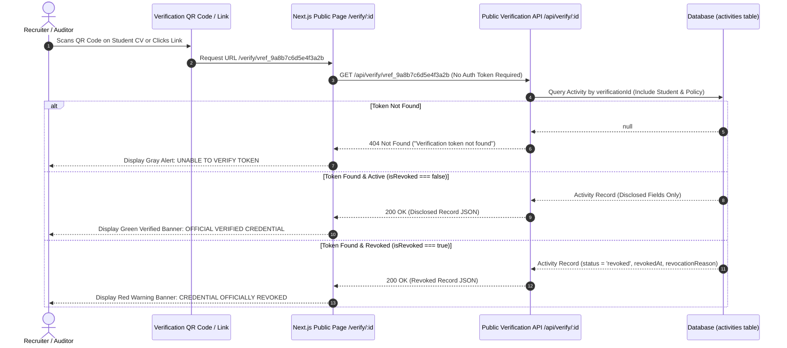

# Public 01. Public Credential Verification Portal

The **Public Credential Verification Portal** ([`frontend/components/public/PublicVerification.jsx`](file:///d:/Edutation(P)/SIH/smart-student-hub/frontend/components/public/PublicVerification.jsx) & [`backend/routes/verify/[verificationId]/route.js`](file:///d:/Edutation(P)/SIH/smart-student-hub/backend/routes/verify/[verificationId]/route.js)) enables recruiters, employers, and NAAC accreditation auditors to independently verify student co-curricular achievements without logging in.

---

## 🔄 Sequence Diagram: Public QR Verification Flow



---

## 📊 Disclosed Information vs. PII Privacy Redaction

To balance verification authenticity with student privacy regulations, the public endpoint applies strict field filtering:

| Disclosed Field | Data Type | Description |
| :--- | :--- | :--- |
| `studentName` | STRING | Student full name (e.g. `John Doe`) |
| `institutionName` | STRING | Institutional name (`CampusSphere / College of Engineering`) |
| `activityTitle` | STRING | Event title (e.g. `Smart India Hackathon 2026 Winner`) |
| `type` | STRING | Activity category (`hackathon`, `certification`, `sports`) |
| `achievementLevel` | STRING | Achievement level (`national`, `state`, `college`) |
| `credits` | DECIMAL | Granted institutional credits (`6.0 Credits`) |
| `naacCriterion` | STRING | Mapped NAAC category (`Criterion 5`) |
| `date` | DATE | Event completion date |
| `approvalDate` | DATE | Stage 2 final sign-off timestamp |

```
+-----------------------------------------------------------------------+
| 🔒 REDACTED PII FIELDS (STRICTLY PROTECTED)                            |
| ✕ Student Email Address          ✕ Student Phone Number               |
| ✕ Student Roll / ID Number       ✕ Internal Database Primary Keys     |
| ✕ Faculty / Admin Remarks        ✕ Account Passwords / JWT Secrets    |
+-----------------------------------------------------------------------+
```

---

## 🎨 Verification Status Banners

### 1. Verified Approved Credential (Active)
```
+-----------------------------------------------------------------------+
| ✓ OFFICIAL INSTITUTIONAL VERIFIED CREDENTIAL                          |
| Verification Token: vref_9a8b7c6d5e4f3a2b                             |
|                                                                       |
| Student: John Doe                                                     |
| Activity: Smart India Hackathon 2026 Winner                           |
| Category: Hackathon • Level: National • Credits: +6.0                 |
| NAAC Criterion: Criterion 5 (Student Support and Progression)         |
| Approval Date: Aug 12, 2026                                           |
+-----------------------------------------------------------------------+
```

### 2. Revoked Credential (Invalidated)
```
+-----------------------------------------------------------------------+
| ⚠️ CREDENTIAL OFFICIALLY REVOKED                                      |
| Verification Token: vref_9a8b7c6d5e4f3a2b                             |
| Revocation Date: Aug 12, 2026                                         |
| Revocation Reason: "Credential revoked due to invalid evidence."      |
+-----------------------------------------------------------------------+
```
