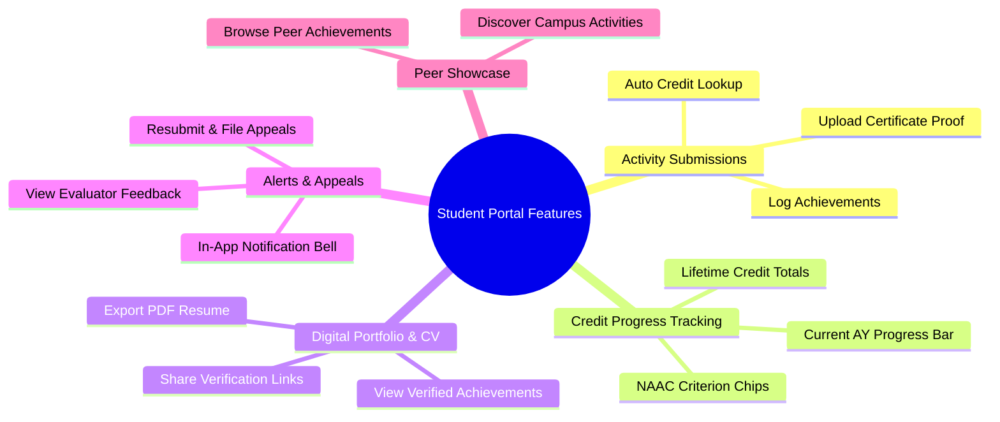

# Student 01. Functionality Overview

Welcome to the **Student Portal** guide for the Smart Student Hub! This platform is your centralized digital space for logging co-curricular achievements, earning institutional degree credits, building verified portfolios, and generating shareable resume credentials.

---

## 🎒 What You Can Do in the Student Portal

---

## 📋 Core Student Features

### 1. Co-Curricular Activity Submissions
- **Easy Logging**: Submit hackathon wins, online certifications, sports awards, NSS/NCC camps, workshops, publications, or internships.
- **Automated Credit Lookup**: Credit points and NAAC criteria are assigned automatically based on college policies — eliminating manual guesswork or self-declaration.
- **Proof Upload**: Attach certificate scans, PDF documents, or verification links to validate your achievements.

### 2. Academic-Year Credit Progress Tracking
- **Annual Target Bar**: Track your current Academic Year (July 1 – June 30) credit standing toward the institutional benchmark of **20.0 Credits**.
- **NAAC Criterion Breakdown**: See your credits categorized by NAAC criteria (e.g. Criterion 5: Student Support).
- **Lifetime Totals**: View your lifetime cumulative credits alongside your current-year standing.

### 3. Digital Portfolio & ATS Resume Export
- **Verified Achievement Showcase**: Access your complete ledger of faculty-verified co-curricular accomplishments.
- **One-Click PDF Resume**: Export a clean, ATS-compliant PDF resume formatted for job applications and campus placement drives.
- **QR Code Verification**: Every PDF resume embeds a QR code that employers or recruiters can scan to verify your credentials instantly online.

### 4. Notifications, Rejection Feedback & Appeals
- **Real-Time Notification Bell**: Receive immediate in-app alerts when a mentor reviews your submission or an admin grants final approval.
- **Evaluator Feedback**: If a submission is rejected, inspect the mentor's specific feedback to understand what needs fixing.
- **Resubmission & Appeals**: Easily update your evidence proof and resubmit, or file a formal appeal to have your submission re-reviewed.

### 5. Peer Achievement Showcase
- **Browse Campus Activity**: Explore co-curricular achievements submitted by peers across various departments for motivation and inspiration.
