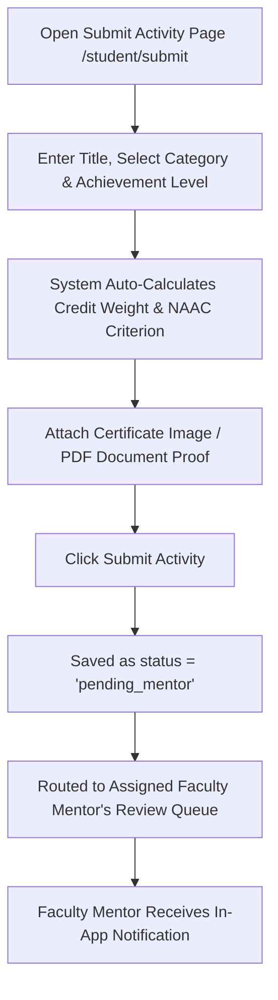

# Student 02. Co-Curricular Activity Submission Guide

Submitting your co-curricular achievements in Smart Student Hub is straightforward. The system ensures fairness by automatically looking up credit point values from official college policy rules based on the activity category and achievement level you select.

---

## 🔄 Step-by-Step Activity Submission Process

---

## 📝 How Credit Points & NAAC Criteria Are Assigned

Unlike traditional systems where students type in their own credit points, Smart Student Hub uses an **Automated Credit Policy Engine**:

1. **You Select**:
   - **Activity Category**: Hackathon, Certification, Sports, NSS/NCC, Workshop, Publication, or Internship.
   - **Achievement Level**: College, State, National, or International.
2. **The System Calculates**:
   - The exact **Credit Weight** (e.g. 6.0 Credits for a National Hackathon win).
   - The mapped **NAAC Criterion** (e.g. Criterion 5 for Student Progression).
3. **Transparency**: You see a live preview of the credit points you will earn before submitting.

---

## 📎 Proof Document Guidelines

To ensure your submission passes faculty evaluation smoothly:
- **Accepted Formats**: JPEG, PNG, or PDF certificate documents.
- **File Quality**: Ensure certificate text, issuing authority logo, student name, and event date are clearly legible.
- **Verification Links**: You can also provide a public URL (e.g. a live project demo, GitHub repository, or online certificate link) to support your claim.

---

## ⏳ What Happens After You Submit?

- **Stage 1 (Faculty Mentor Review)**: Your submission immediately enters your assigned faculty mentor's review queue with status `pending_mentor`.
- **Stage 2 (Admin Final Sign-Off)**: Once your mentor approves Stage 1 (`mentor_approved`), the submission moves to the Admin Queue for final approval (`approved`), official credit award, and verification token generation.
