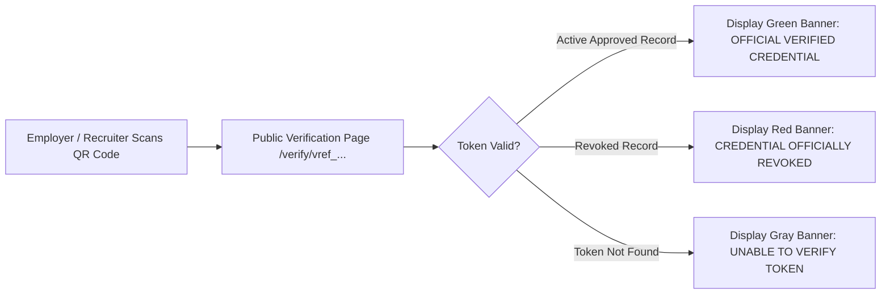

# Student 03. Digital Portfolio & Verifiable Credential QR Codes

The **Digital Portfolio** ([`frontend/components/student/Portfolio.jsx`](file:///d:/Edutation(P)/SIH/smart-student-hub/frontend/components/student/Portfolio.jsx)) is your verified academic showcase. It organizes all your faculty-approved co-curricular accomplishments, lets you download an ATS-friendly PDF resume, and generates instant verification QR codes.

---

## 📄 ATS-Friendly PDF Resume Export

When you click **[Download CV (PDF)]** on your portfolio page:
1. The system generates a clean, professionally formatted PDF resume including your academic details, contact information, and verified activity history categorized by domain.
2. Every approved activity in the PDF includes an embedded **Verification QR Code** and a unique cryptographic token (e.g. `vref_9a8b7c6d5e4f3a2b`).

```
+-------------------------------------------------------------+
| JOHN DOE - B.Tech Computer Science & Engineering            |
| Year 3 • ID: STU-2026-042 • john.doe@university.edu         |
+-------------------------------------------------------------+
| VERIFIED CO-CURRICULAR ACTIVITIES                           |
|                                                             |
| • Smart India Hackathon 2026 Winner (+6.0 Credits) [QR]     |
|   Token: vref_9a8b7c6d5e4f3a2b                              |
|   Verification URL: https://hub.edu/verify/vref_...        |
+-------------------------------------------------------------+
```

---

## 🔍 How Public QR Verification Works

When a recruiter, employer, or NAAC auditor scans the QR code on your resume or clicks your public verification link:



### What the Public Verification Page Displays

To protect your personal privacy, the public page shows **only** official credential details:
- **Disclosed**: Your Full Name, College/University Name, Activity Event Title, Category, Achievement Level, Credits Awarded, NAAC Criterion, and Approval Date.
- **Hidden / Protected**: Your email address, phone number, internal roll number, mentor remarks, and personal account data are **never** shown to external viewers.

---

## ⚠️ Understanding Credential Revocation

If college administrators discover that an approved activity submission contained invalid or tampered evidence, they may revoke the credential:

1. **In Your Student Portal**: The activity status changes to `rejected` with a note explaining the revocation reason.
2. **On the Public Verification Page**: Scanning the QR code no longer shows a green verified checkmark. Instead, it displays a prominent red warning banner:
   
```
[⚠️ CREDENTIAL OFFICIALLY REVOKED]
This credential was revoked by College Administration on Aug 12, 2026.
Reason: "Credential revoked due to invalid certificate evidence during audit."
```
