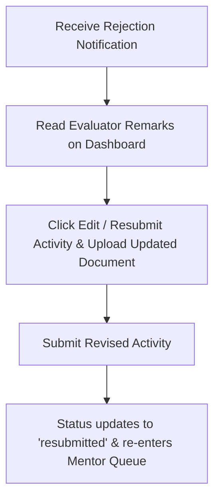

# Student 05. In-App Notifications, Feedback & Appeals

CampusSphere keeps you informed about your submission progress through instant in-app alerts and provides a clear process for addressing rejected submissions.

---

## 🔔 In-App Notification System

Click the **Notification Bell** icon in the top header ([`TopHeader.jsx`](file:///d:/Edutation(P)/SIH/smart-student-hub/frontend/components/shared/TopHeader.jsx)) to view your alerts:

```
[🔔 Notifications (2 Unread)]
• ✓ Stage 1 Passed: Your "Smart India Hackathon" submission was approved by Dr. Sarah Jenkins.
• ✕ Needs Revision: Your "Cyber Security Workshop" submission was rejected. Reason: "Certificate scan is blurry."
```

### Trigger Events You Will Receive

| Notification Event | Message Content |
| :--- | :--- |
| **Stage 1 Approval** | *"Your submission '[Title]' passed mentor verification and advanced to Stage 2."* |
| **Stage 2 Final Approval** | *"Congratulations! Your submission '[Title]' received final sign-off (+[X] Credits)."* |
| **Rejection** | *"Your submission '[Title]' was rejected. Evaluator Remarks: '[Remarks]'"* |
| **Credential Revocation** | *"Your credential for '[Title]' has been revoked by Administration."* |

---

## 🔄 How to Fix a Rejected Submission (Resubmission Flow)

If a mentor or admin rejects your submission, don't worry! You can easily update your evidence and resubmit:



---

## ⚖️ Filing a Formal Grievance / Appeal

If you believe a submission was rejected unfairly or your proof was misunderstood:

1. Navigate to your submission entry under **Activity History**.
2. Click **[File Grievance / Appeal]**.
3. Type a clear statement explaining your dispute (e.g., *"Uploaded original PDF issued directly by the State Sports Authority"*).
4. Click **[Submit Appeal]**.
5. Your appeal enters the **Admin Grievance Queue**. An administrator will review your evidence and either **Overturn & Approve** your submission or confirm the rejection with formal remarks.
